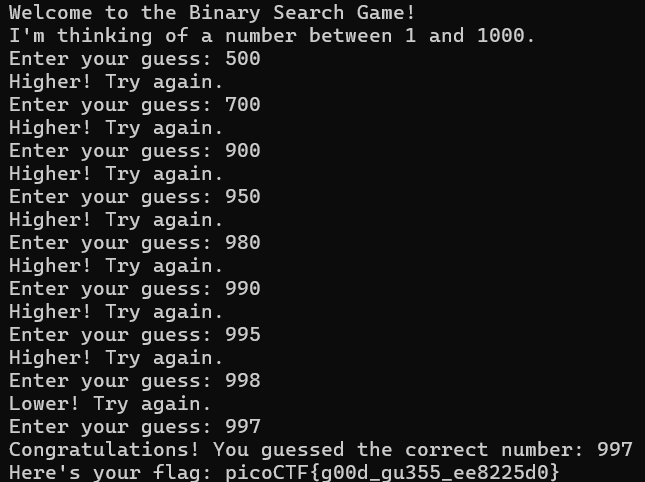

# Binary Search Game Write-Up

## Challenge Overview

The challenge presents a game where we must guess a number between 1 and 1000 in at most 10 attempts. This is a classic use case for **binary search**, an efficient algorithm for searching in a sorted list by repeatedly dividing the search space in half.

Cybersecurity professionals often deal with large datasets, such as log files and vulnerability reports. Understanding and manually practicing search algorithms can help when developing automated tools for analyzing such data efficiently.

## Solution Approach

To solve this challenge optimally, I used the **binary search strategy**:

1. **Start in the middle** → Guess 500.
2. **Adjust based on feedback** → If the guess is too low, move higher; if too high, move lower.
3. **Repeat, halving the range each time** until the correct number is found.

## Execution Walkthrough

Below is how I solved the challenge step by step:



After following this strategy, I successfully found the correct number **997** within 10 guesses, obtaining the flag:

```
picoCTF{g00d_gu355_ee8225d0}
```

## Lessons Learned

- **Binary Search** is a powerful and efficient search technique that reduces the number of guesses exponentially.
- Applying fundamental algorithms manually can reinforce cybersecurity skills, especially when analyzing large datasets.
- This type of challenge can help in situations such as forensic analysis, log analysis, and automated scanning.

By mastering these techniques, we can better optimize security-related tasks in real-world applications! 🚀
