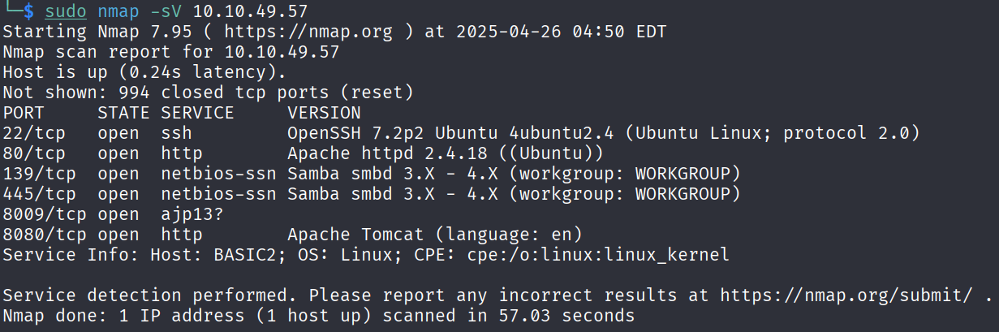
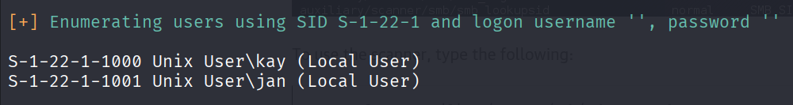
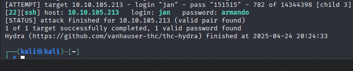
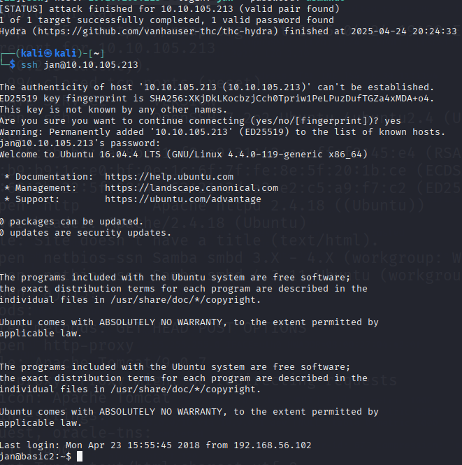
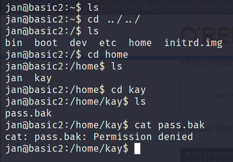
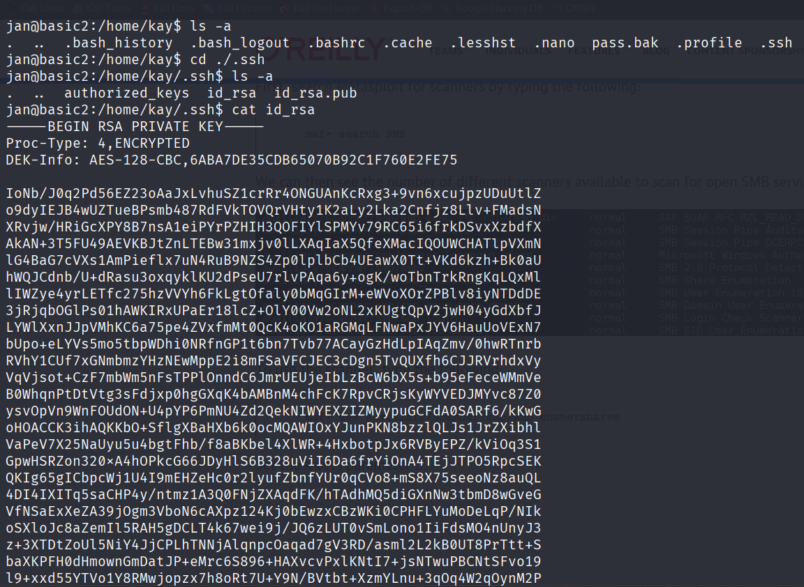
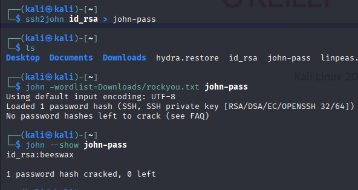

# 🧾 Daily CTF Writeup – [Basic Pentesting](https://tryhackme.com/room/basicpentestingjt)

- **Date:** 2025-04-25  
- **Difficulty:** Easy  
- **OS:** Linux  
- **Hecker:** Jerome Infante  

---

# 🔍 Reconnaissance

## 🔍 Nmap Scan Results

- Open ports: **22 (SSH)** and **139/445 (SMB)**
- Let's move on to enumerating SMB.

## 🔍 SMB Enumeration with enum4linux

- Found two users: **jan** and **kay**.
- Targeting **jan** for password attacks first.

---

# 🔍 Password Attacks

## 🔍 Hydra Attack on SSH

- Hydra successfully cracked **jan**'s SSH password.
- Time to log in via SSH!

## 🔍 SSH Access as Jan

- Logged in as **jan**.
- Now, let's dig around for anything related to **kay**.

## 🔍 Finding Kay's Files

- Found something in **kay**'s folder.
- But no permission to read it yet.

## 🔍 Stuck? Not Really.

- Found Kay's **encrypted RSA private key**.
- Need to crack it to move forward.

---

# 📉 Cracking the Key

## 🔍 John the Ripper to the Rescue

- Used **John** to crack the encrypted private key.
- Got Kay's password!

## 🔍 SSH Access as Kay

- Logged in as **kay**.
- Root access achieved.

---

# 🔍🎉 HAPPY HACKING!

