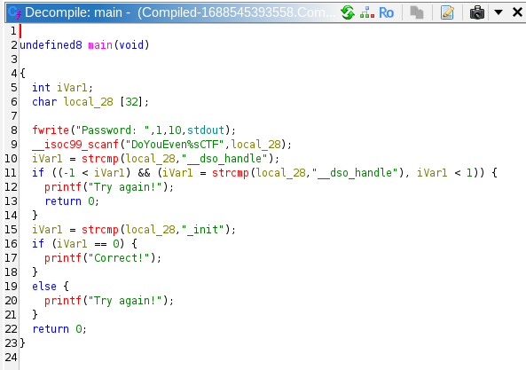

# 🧾 Daily CTF Writeup – [Compiled](https://tryhackme.com/room/compiled/)

- **Date:** 2025-01-04 📅
- **Difficulty:** Easy 🟢
- **OS:** Linux 🐧
- **Hacker:** Jerome Infante 👨‍💻

## 📋 Challenge Overview

This challenge involves reverse engineering a compiled binary to find the correct password. The binary appears to be a simple password checker program.

## 🔍 Initial Analysis

First, I downloaded the challenge file and started by examining the strings within the binary to gather information about its structure and potential passwords.

```bash
strings Compiled.compile
```result
/lib64/ld-linux-x86-64.so.2
jKUhR
__cxa_finalize
__libc_start_main
strcmp
stdout
__isoc99_scanf
fwrite
printf
libc.so.6
GLIBC_2.7
GLIBC_2.2.5
GLIBC_2.34
_ITM_deregisterTMCloneTable
__gmon_start__
_ITM_registerTMCloneTable
PTE1
u+UH
StringsIH
sForNoobH
Password: 
DoYouEven%sCTF
__dso_handle
_init
Correct!
Try again!
;*3$"
GCC: (Debian 11.3.0-5) 11.3.0
Scrt1.o
__abi_tag
crtstuff.c
deregister_tm_clones
__do_global_dtors_aux
completed.0
__do_global_dtors_aux_fini_array_entry
frame_dummy
__frame_dummy_init_array_entry
zzz.c
__FRAME_END__
_DYNAMIC
__GNU_EH_FRAME_HDR
_GLOBAL_OFFSET_TABLE_
__libc_start_main@GLIBC_2.34
_ITM_deregisterTMCloneTable
stdout@GLIBC_2.2.5
_edata
_fini
printf@GLIBC_2.2.5
__data_start
strcmp@GLIBC_2.2.5
__gmon_start__
__dso_handle
_IO_stdin_used
_end
__bss_start
main
__isoc99_scanf@GLIBC_2.7
fwrite@GLIBC_2.2.5
__TMC_END__
_ITM_registerTMCloneTable
__cxa_finalize@GLIBC_2.2.5
_init
.symtab
.strtab
.shstrtab
.interp
.note.gnu.property
.note.gnu.build-id
.note.ABI-tag
.gnu.hash
.dynsym
.dynstr
.gnu.version
.gnu.version_r
.rela.dyn
.rela.plt
.init
.plt.got
.text
.fini
.rodata
.eh_frame_hdr
.eh_frame
.init_array
.fini_array
.dynamic
.got.plt
.data
.bss
.comment
```
### Key Strings Found:
- `Password: ` - Indicates this is a password checker
- `DoYouEven%sCTF` - Potential password template with format specifier
- `Correct!` and `Try again!` - Success/failure messages
- `strcmp` - String comparison function being used
- `_init` - Important section that might be part of the password

## 🧪 Initial Password Attempt

From the strings output, I identified a potential password: `DoYouEven%sCTF`

```bash
./Compiled.compile
# Entered: DoYouEven%sCTF
# Result: Incorrect password
```

The password didn't work as expected. The `%s` format specifier suggested that something needs to be substituted in place of `%s`.

## 🔬 Reverse Engineering with Ghidra

Since the initial password attempt failed, I opened the binary in Ghidra to analyze the source code and understand the password checking logic.



### Code Analysis:

From the Ghidra decompilation, I could see the password checking mechanism. The key insight was that the `%s` in the password template `DoYouEven%sCTF` gets replaced with `_init`, which corresponds to the `.init` section found in the ELF binary.

## 🎯 Solution

The correct password is: **`DoYouEven_init`**

### Verification:
```bash
./Compiled.compile
# Entered: DoYouEven_init
# Result: Correct!
```

## 📚 Key Takeaways

1. **String Analysis**: Always start with `strings` command to identify potential passwords and program behavior
2. **Format Specifiers**: Pay attention to format specifiers like `%s` which indicate dynamic content
3. **ELF Sections**: Understanding ELF binary structure (like `.init` section) can provide clues for password construction
4. **Static Analysis**: When dynamic analysis fails, static analysis tools like Ghidra can reveal the actual program logic

## 🛠️ Tools Used

- `strings` - Extract printable strings from binary
- `Ghidra` - Static analysis and reverse engineering
- `file` - Identify file type (ELF binary)

---
**Flag/Password:** `DoYouEven_init`