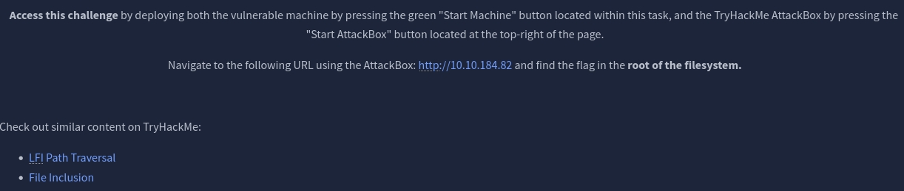
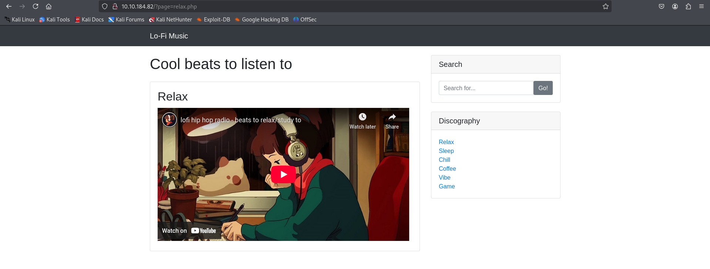
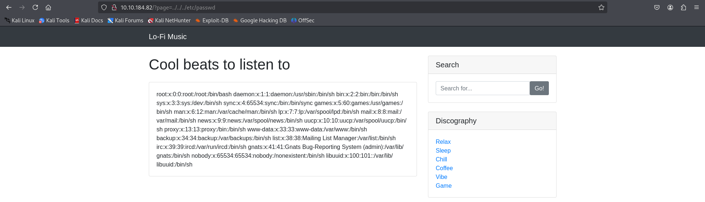
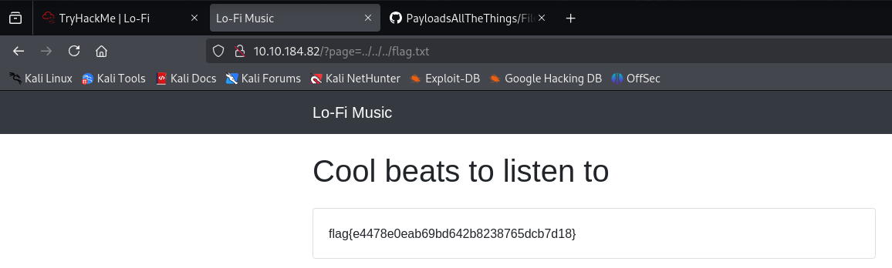

# 🧾 Daily CTF Writeup – [Lo-fi](https://tryhackme.com/room/lofi)

- **Date:** 2025-06-26
- **Difficulty:** Easy
- **OS:** Linux
- **Hecker:** Jerome Infante

## 🧠 Challenge Description

Based on the challenge description, it was clear that the flag is located in the root file system of the web server. It also hinted at similar content on TryHackMe and mentioned keywords like:

- LFI (Local File Inclusion)

- Path Traversal

- File Inclusion

This suggested that the web application might be vulnerable to LFI attacks.



### 🖥️ Initial Web App Analysis

Upon launching the web app, I began inspecting its behavior.



I noticed that clicking on various anchor links caused the URL to change dynamically, which led me to suspect a possible LFI vulnerability.

### 🔍 Testing for LFI

To test for Local File Inclusion, I attempted the following classic payload:

```
../../../etc/passwd
```

This payload is commonly used to test for LFI because it targets a well-known file on Unix-based systems.

To my surprise, it worked.



The presence of /etc/passwd confirmed that the root file system was exposed and the application was indeed vulnerable to LFI.

### 🎯 Locating the Flag

Now that I had access to the root file system, I modified the payload by replacing /etc/passwd with flag.txt:

```
../../../flag.txt
```

This allowed me to successfully retrieve the flag.


# 🔚 HAPPY HACKING!
