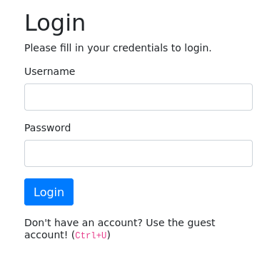
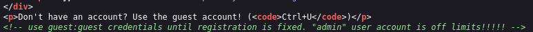
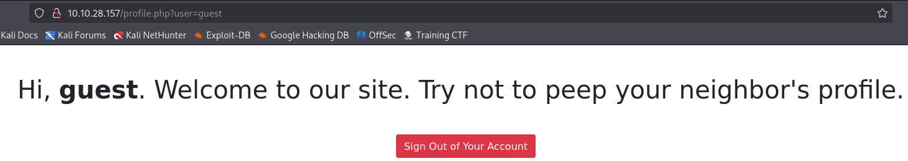
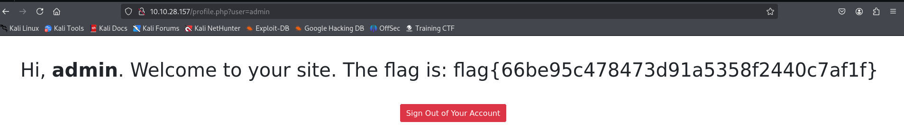

# 🧾 Daily CTF Writeup – [Neighbour](https://tryhackme.com/neighbour/)

- **Date:** 2025-07-4 📅
- **Difficulty:** Easy 🟢
- **OS:** Linux 🐧
- **Hacker:** Jerome Infante 👨‍💻

## 🎯 Challenge Overview

This is a beginner-friendly web exploitation challenge focusing on authentication bypass and URL manipulation.

## 🚀 Solution Walkthrough

### Step 1: Initial Website Analysis 🔍

  
The website indicates that if you don't have an account, you can press `Ctrl + U` to use the guest account.

### Step 2: Finding Guest Credentials 🔑

By viewing the page source, we discovered the credentials for the guest account: `guest:guest`

### Step 3: Successful Login ✅

After logging in successfully, I noticed the URL structure. This made me wonder: what if I try to change the user parameter to `admin`?

### Step 4: Flag Capture 🎉

Success! By manipulating the URL to access the admin panel, we captured the flag! 🏁

## 🔍 Key Takeaways

- Always inspect the page source for hidden information 🕵️
- URL parameters can sometimes be manipulated for privilege escalation 🔓
- Simple authentication mechanisms may have vulnerabilities 🛡️

## ⚡ Skills Demonstrated

- Web reconnaissance
- Source code analysis
- URL manipulation
- Authentication bypass
