# 🧾 Daily CTF Writeup – [Pickle Rick](https://tryhackme.com/room/picklerick)

- **Date:** 2025-04-24  
- **Difficulty:** Easy  
- **OS:** Linux  
- **Hecker:** Jerome Infante  

---

## 🔎 Reconnaissance

### 🔍 Nmap Scan Results

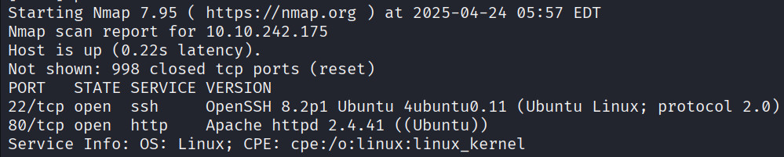  
The scan reveals that **SSH** and **Apache** are running on the target machine.

---

## 🌐 Web Application

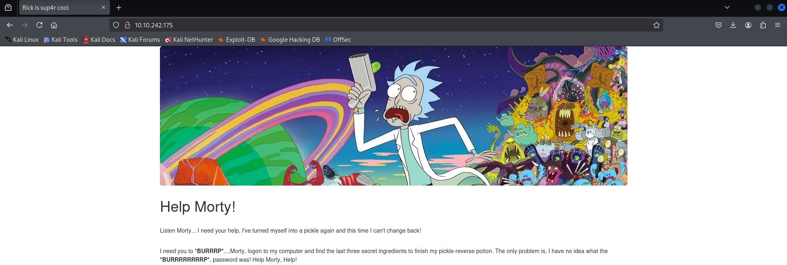  
A basic **web app** is hosted and accessible via the browser.

---

## 🔍 Web Enumeration

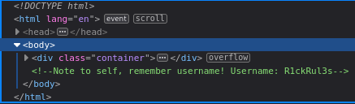  
By inspecting the page source, I discovered an **account username** hardcoded in the HTML.

---

## 🛠️ Directory Busting

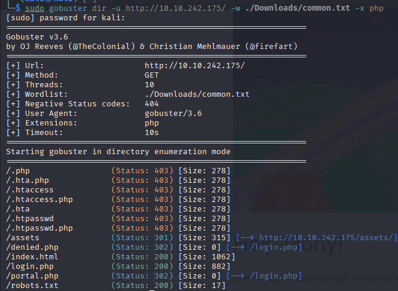  
I performed dirbusting to search for hidden files and directories.

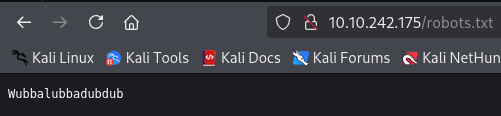  
Found a **login page** and a `robots.txt` file. The file revealed a **password**, which matches the previously found username.

---

## 📜 Command Injection to Read Files

After logging in, I found a field vulnerable to **command injection**.

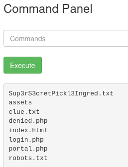  
Using commands like `ls`, I discovered new `.txt` files containing clues.

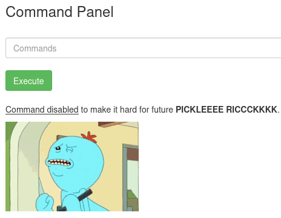  
Attempted to use the web form to read them with `cat`, but it didn’t work properly in the response.

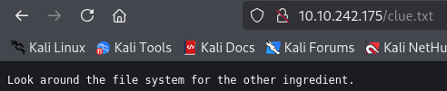  
A clue mentioned that the **flags are hidden deeper in the system**.

---

## 📁 Hidden Backup File Found

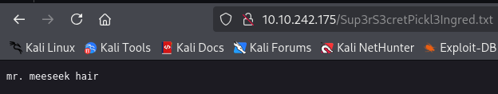  
Discovered a hidden backup file and retrieved the **first flag**

---

## 🖥️ Reverse Shell Access
Used the vulnerability to spawn a **reverse shell**, gaining full access to the system.

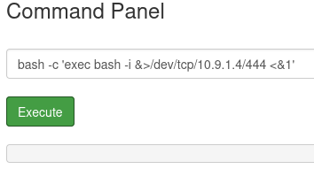  
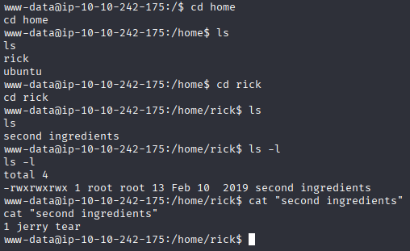  
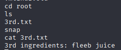  

---

# 🔚 HAPPY HACKING!
