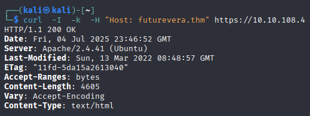
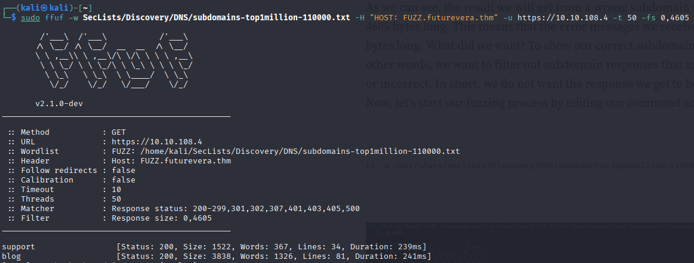
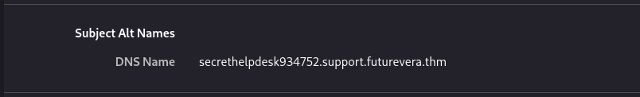
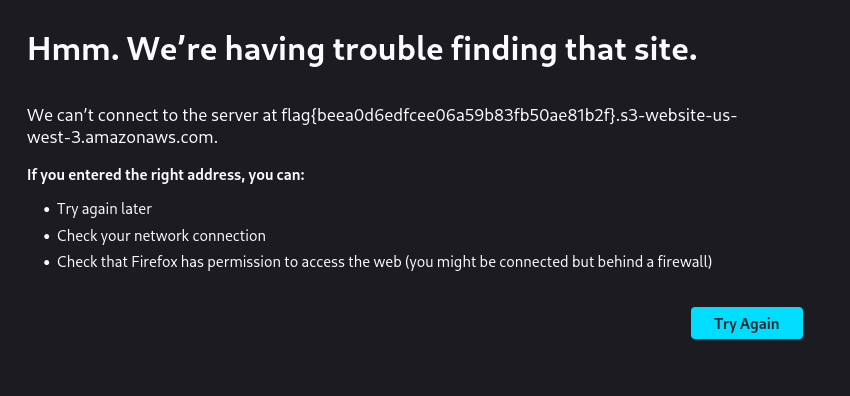

# 🧾 Daily CTF Writeup – [Take Over](https://tryhackme.com/room/takeover)

- **Date:** 2025-07-5 📅
- **Difficulty:** Easy 🟢
- **OS:** Linux 🐧
- **Hacker:** Jerome Infante 👨‍💻

## 🎯 Challenge Overview

This challenge focuses on subdomain enumeration, SSL certificate analysis, and protocol manipulation to capture the flag.

## 🚀 Solution Walkthrough

### Step 1: Initial Reconnaissance with cURL 🔍

Let's start by curling the target and checking the content-length to gather initial information.

### Step 2: Subdomain Enumeration with FFUF 🔎

I used the FFUF tool to check for subdomains and discovered 2 of them: `support` and `blog`. I then added them to `/etc/hosts` for proper resolution.

### Step 3: SSL Certificate Analysis 🔐

After adding the subdomains to `/etc/hosts`, I visited the URL and checked the SSL certificate warning. I found a suspicious long string subdomain, so I added it to `/etc/hosts` again.

### Step 4: Protocol Manipulation & Flag Capture 🎉

When I entered the URL, it wasn't revealing the flag initially. That's when I removed the 's' from `https` (switching to `http`), and the flag showed up!

## 🔍 Key Takeaways

- Subdomain enumeration is crucial for discovering hidden attack surfaces 🕵️
- SSL certificates can leak information about additional subdomains 📜
- Sometimes switching protocols (HTTPS ↔ HTTP) can reveal different content 🔄
- Always check certificate details for potential clues 🔍

## ⚡ Skills Demonstrated

- Subdomain enumeration with FFUF
- SSL certificate analysis
- Host file manipulation
- Protocol switching techniques
- Web reconnaissance
