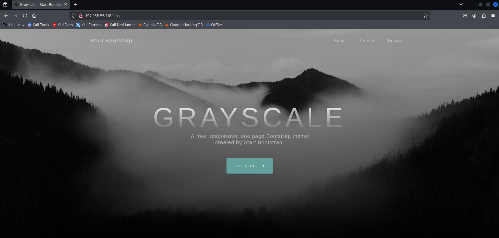
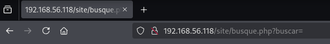
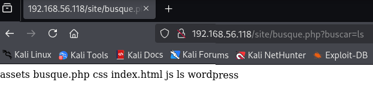
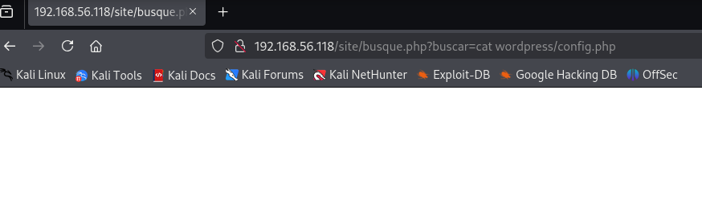
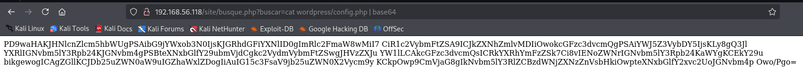
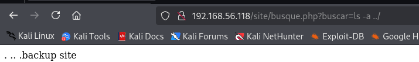
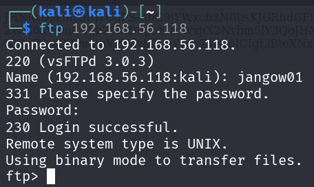
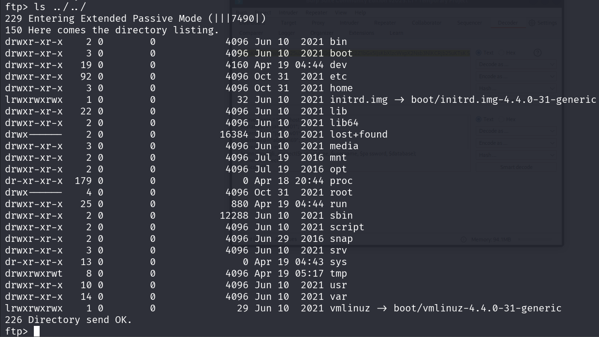
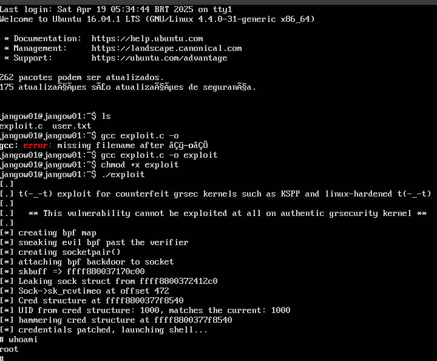
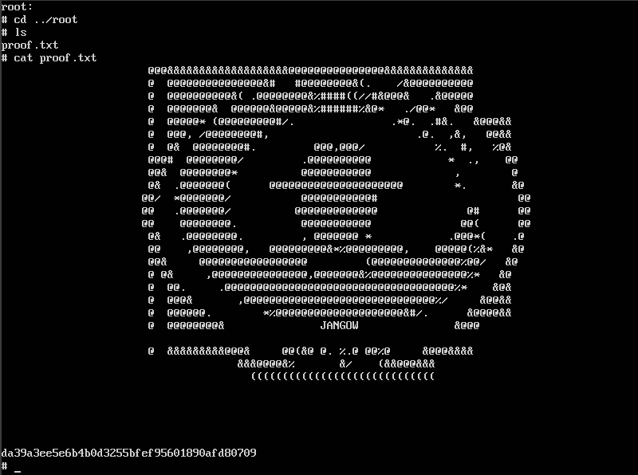

## 🧾 Daily CTF Writeup – [Jangow-01](https://www.vulnhub.com/entry/jangow-101,754/)

**Date:** `[2025-04-19]`  
**Difficulty:** `[Easy]`  
**OS:** `[Linux]`


---


This is the virtualbox that we are going to attack


**Nmap Results:**  


Now the open ports are ftp and apache


I tried to login using the anonymous as username and password and we failed to login



I enter the ip address on firefox and a wep app opened i searched everywhere in this website until i found some intersting vulnerabilty




A local file intrusion(LFI) vulnerabilty



Played with the parameters by using the unix command line commands such as the ls, now that i found some intersting files, time to read them




cat command is not working here, so i googled how to cat in a url and i found that you can cat but in base64


```
PD9waHAKJHNlcnZlcm5hbWUgPSAibG9jYWxob3N0IjsKJGRhdGFiYXNlID0gImRlc2FmaW8wMiI7 CiR1c2VybmFtZSA9ICJkZXNhZmlvMDIiOwokcGFzc3dvcmQgPSAiYWJ5Z3VybDY5IjsKLy8gQ3Jl YXRlIGNvbm5lY3Rpb24KJGNvbm4gPSBteXNxbGlfY29ubmVjdCgkc2VydmVybmFtZSwgJHVzZXJu YW1lLCAkcGFzc3dvcmQsICRkYXRhYmFzZSk7Ci8vIENoZWNrIGNvbm5lY3Rpb24KaWYgKCEkY29u bikgewogICAgZGllKCJDb25uZWN0aW9uIGZhaWxlZDogIiAuIG15c3FsaV9jb25uZWN0X2Vycm9y KCkpOwp9CmVjaG8gIkNvbm5lY3RlZCBzdWNjZXNzZnVsbHkiOwpteXNxbGlfY2xvc2UoJGNvbm4p Owo/Pgo= 
```


Using the burpsuite tool i decoded the base64 and it is a credentials


I used the credentials to login, but i failed to login, time to search some files again 



There's a backup file and it's hidden


Another base 64 again


Different username, let's try to login



I'm in!



now we are inside, time to get root now that we see the linux version, let's find CVE 

We got the cve 
[CVE:2017-6074](https://www.exploit-db.com/exploits/41458)

Now let's copy the code and write a new file named exploit.c


Next, we transfer the exploit to the machine by using the PUT


login on the machine using the credentials we got, now that we can see the file we just transfered i compiled the code and run the executable file and now we are now the root user



after exploiting, look for the root folder where the flag is



# HAPPY HACKING!